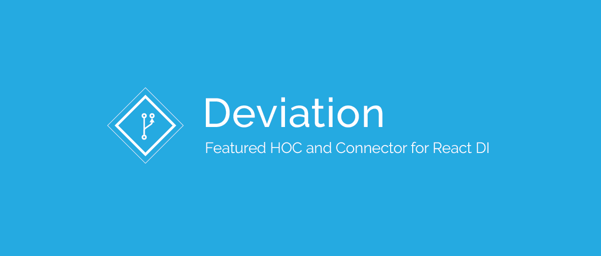

[](https://github.com/semantic-release/semantic-release)
[](https://travis-ci.com/react-epic/deviation)
[](https://spectrum.chat/react-epic)

<div align="center">
  
  

</div>

## Install

You can install Deviation by either using PNPM, Yarn or NPM:

```bash
# PNPM
$ pnpm add deviation

# Yarn
$ yarn add deviation

# NPM
$ npm add deviation
```

## What is Deviation?

Deviation is a library that trying to simulate Angular DI model into React using RxJS and React Context API. Here is our example:

[](https://codesandbox.io/s/2wp6217v8r)

```jsx
import { Deviation, Store, Inject } from 'deviation'

export class TodoStore extends Store {
  state = {
    todos: []
  }

  addTodo(newTodo) {
    this.setState(({ todos }) => ({
      todos: todos.concat([newTodo])
    }))
  }
}

ReactDOM.render(
  <Deviation providers={[TodoStore]}>
    <TodoApp />
  </Deviation>,
  document.querySelector('#root')
)

@Inject({
  todoStore: TodoStore
})
export class TodoApp extends React.Component {
  handleSubmit = event => {
    this.props.todoStore.addTodo(event.target.value)
  }

  render() {
    const { todoStore } = this.props

    return (
      <div>
        <ul>
          {todoStore.state.todos.map(todo => (
            <li>{todo}</li>
          ))}
        </ul>
        <div>
          <label for="new-todo">New Todo:</label>
          <input
            name="new-todo"
            type="input"
            onKeyDown={enter(this.handleSubmit)}
          />
        </div>
      </div>
    )
  }
}
```

## Store DI

We can also use DI to inject directly store into store:

```jsx
@Inject({
  balanceStore: BalanceStore
})
export class ContractStore extends Store {}
```

Remember, stores are injected in order. For example:

```jsx
ReactDOM.render(
  <Deviation providers={[BalanceStore, ContractStore]}>
    <TodoApp />
  </Deviation>,
  document.querySelector('#root')
)
```

In this example, `BalanceStore` will be injected before `ContractStore`. However, if `ContractStore` is placed behind `BalanceStore` in the list of providers: `[BalanceStore, ContractStore]`, then after `ContractStore` constructor is called and before `storeDidMount` is called, `BalanceStore` will be injected into `ContractStore`.

## Lazy DI and Cyclic DI

Sometimes, you may need Cyclic Dependency Injection. Deviation also provides you with Cyclic DI:

```jsx
@Inject({
  storeA: () => StoreA
})
export class StoreB extends Store {
  get storeA() {
    return this.props.storeA
  }
}

@Inject({
  storeB: () => StoreB
})
export class StoreA extends Store {
  get storeB() {
    return this.props.storeB
  }
}
```

## Testing

To test on a single Store method is easy. You just have to stub or spy on that method:

```jsx
export class PhoneStore extends Store {
  makeAPhoneCall() {}
}

const spy = sinon.spy(PhoneStore.prototype.makeAPhoneCall)
expect(spy.calledOnce).to.be.true
```

However, we are more likely to extract the store instance from the providers. In that case, we can create a store extractor that can help us to extract any store instance from `Deviation`:

```jsx
import { createStoreExtractor } from 'deviation'

const Extractor = createStoreExtractor()

mount(
  <Deviation providers={[PhoneStore, Extractor]}>
    <AppComponent />
  </Deviation>
)

const phoneStore = Extractor.getStore(PhoneStore)
```
