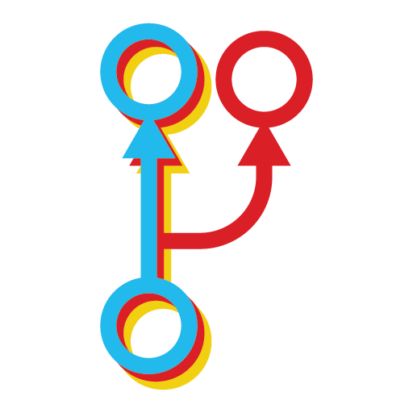

<div align="center">
  
  # Deviation

  

  Featured DI System for React 🎁🏠

</div>

## Install

You can install Deviation by either using PNPM, Yarn or NPM:

```bash
# PNPM
$ pnpm add deviation

# Yarn
$ yarn add deviation

# NPM
$ npm add deviation
```

## What is Deviation?

Deviation is a library that trying to stimulate Angular DI model into React using RxJS and React Context API. Here is our example:

```jsx
ReactDOM.render(
  <Provider values={[TodoStore, HttpProvider]}>
    <TodoApp />
  </Provider>,
  document.querySelector('#root')
)

export class TodoStore extends Store {
  state = {
    todos: []
  }

  addTodo(newTodo) {
    this.setState(({ todos }) => ({
      todos: todos.concat([newTodo])
    }))
  }
}

@Deviate({
  todoStore: TodoStore
})
export class TodoApp extends React.Component {
  render() {
    const { todoStore } = this.props

    return (
      <div>
        <ul>
          {todoStore.state.todos.map(todo => (
            <li>{todo}</li>
          ))}
        </ul>
        <button onClick={todoStore.addTodo}>Add Todo</button>
      </div>
    )
  }
}
```
